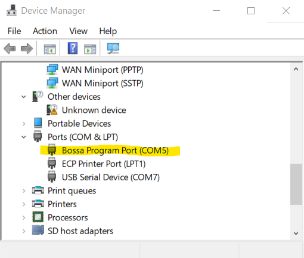

===============
Troubleshooting
===============

If you can’t connect via the serial port
^^^^^^^^^^^^^^^^^^^^^^^^^^^^^^^^^^^^^^^^^^^^^^^^^

Try this:

-  From the Windows Device Manager, select “View -> Show Hidden
   Devices”.
-  Under the “Ports (COM & LPT)”, right click each of the COM entries
   and select “Uninstall Device”.

   -  Check the “Delete the driver software for this device”.
   -  Repeat for each of the COM ports.

-  Reboot your computer.

How do I find the serial port used by the Archim?
^^^^^^^^^^^^^^^^^^^^^^^^^^^^^^^^^^^^^^^^^^^^^^^^^

-  Open the Window Device Manager
-  Expand the section called “Ports (COM & LPT)”

   -  If you see “Serial GCode 3D Printer”, the printer is online, but
      is not ready to accept firmware.
   -  If you see “3D Printer powered by RAMBo”, the printer is online,
      but is not ready to accept firmware.
   -  If you see “Bossa Program Port” as one of the entries, it means
      the board is ready to accept firmware.

Other issues you may encounter
^^^^^^^^^^^^^^^^^^^^^^^^^^^^^^

-  The Archim is a lot more finicky when it comes to flashing. I have
   instructions `here <How-to-Flash-Archim-Firmware>`__
-  The drivers on the Archim 2.0 can easily overheat. Overheating
   drivers may cause:

   -  Skipped steps on Z and foreshortening of prints
   -  The extruder motor may stop during a print

-  The default firmware settings in Drunken Octopus are taken from the
   TAZ Pro and have *not* been validated for a TAZ 6 or Workhorse
   (because I don’t own these printers), therefore they may not be
   optimal. I suggest experimenting with the following commands:

   -  `M906 TMC Motor
      Current <https://marlinfw.org/docs/gcode/M906.html>`__
   -  `M569 Set TMC stepping
      mode <https://marlinfw.org/docs/gcode/M569.html>`__
   -  `M119 TMC OT Pre-Warn
      Condition <https://marlinfw.org/docs/gcode/M911.html>`__
   -  `M912 Clear TMC OT
      Pre-Warn <https://marlinfw.org/docs/gcode/M912.html>`__
   -  `M122 TMC Debugging <https://marlinfw.org/docs/gcode/M122.html>`__

-  If you find better settings, please let me know about them and I can
   add them to drunken octopus.
-  Another thing to try is to `wire your Z motors in
   series <https://www.instructables.com/id/Wiring-Your-Z-Stepper-Motors-in-Series>`__.
   This may put less load on the Trinamic drivers.
